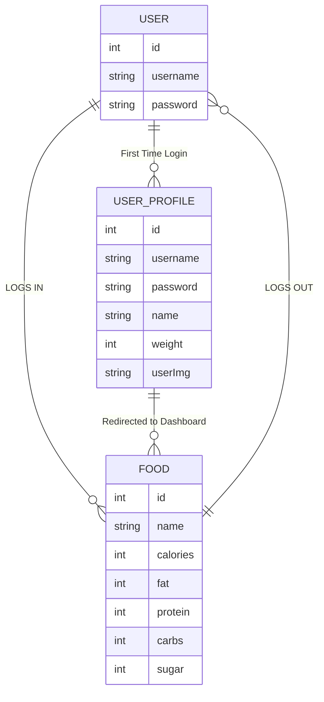

# CalTrack

- **Contributors:** Isaac Asher
- [**Backend Source Code**](https://github.com/isaacasher97/calTrack_backend_pj4)
- [**Frontend Source Code**](https://github.com/isaacasher97/calTrack_frontend_pj4)
- [**Deployed Backend Site**](https://caltrack-backend-2eww.onrender.com)
- [**Deployed Frontend Site**]()
- [**Jira Board**](https://id.atlassian.com/invite/p/jira-software?id=gCZCOldCQ92yWtjJuLRvxA)

## Technologies

- React
- Python
- Django
- Node
- postgreSQL
- HTML
- Sass

## Description 🍲

CalTrack takes the guesswork out of tracking your daily caloric intake!  Through a form, users can add every meal that they have throughout their day. By setting themselves a goal, users can also utilize CalTrack to reach that nutritional goal with ease.

Whether you're interested in losing weight, taking a shot at a new diet routine, or simply want to keep your healthy lifestyle HEALTHY, CalTrack is your go-to app for keeping your nutritional health in check.

Join the CalTrack community today and make every day a nutritionally healthy one, Happy Tracking!

## Main Features 🍲
Add Your meals throughout each day to keep track of your daily intake

- Daily Tracking: An intuitive tracking system that allows you to track you calories day by day, as opposed to making a post for each day seperately. 

- User Profiles: Users Will have access to their profile page, allowing them to update their weight, age, Goals, etc.

## Mock UP of UI 🍲
***Auth Page***

***Dashboard Page***

***Single Food Page***

***User Profile Page***

***User Profile Edit/Update Page***

## Endpoints 🍲

## Schemas 🍲

## ERD (ENTITY RELATIONSHIP DIAGRAM) 🍲
